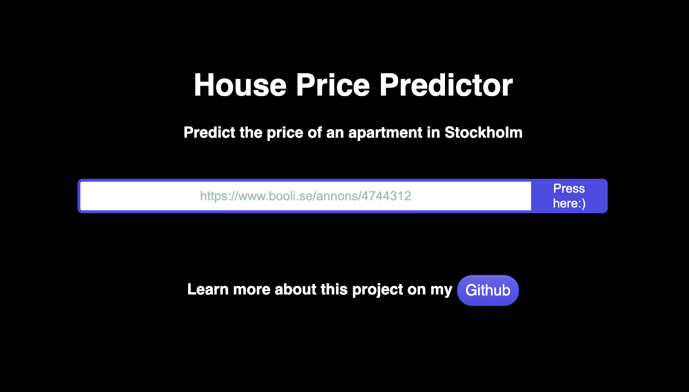
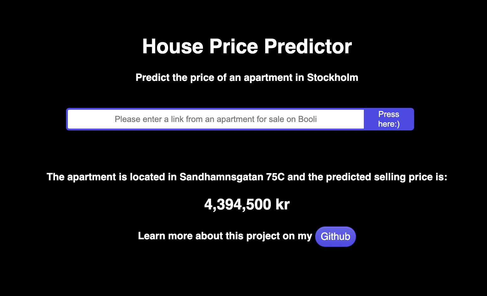

# 🏡 Stockholm apartment price predictor 🏡

## 🏘 Parameters used in this model
An application that predict the selling price of an apartment in Stockholm based on the following parameters
- Size
- Area
- Nr of rooms
- Monthly Fee.

## 💾 Data used
The model is trained on 7000+ previous sales in the Stockholm area and the data is scraped from booli. 

## ☁️ Hosting
The model is hosted on an Amazon EC2 instance.

#### Try out the application <a href="http://ec2-16-170-219-39.eu-north-1.compute.amazonaws.com:8080/" target="_blank">here</a>!

## Prints from application  

